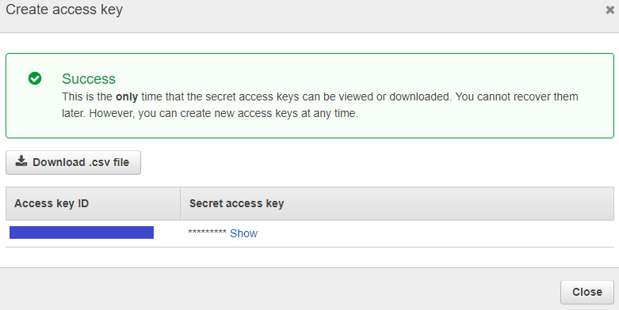
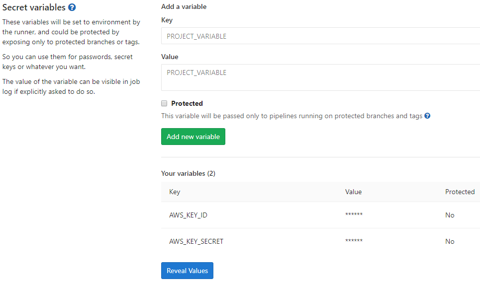

# DevOps Academy Gitlab 101 CI/CD

In this tutorial, we'll focus on DevOps, as well as testing and hosting games with Continuous
Integration/Deployment methods using [GitLab CI/CD](https://docs.gitlab.com/ee/ci/README.html).

## Project

this project is a on web game hosted on AWS that Consists of a simple spaceship traveling in space that shoots by clicking the mouse in a given direction. 


## instructions

1. create your own fork of this project
2. Set up S3 Bucket
   1. Log into your AWS account and go to [S3](https://console.aws.amazon.com/s3/home)
   2. Click the **Create Bucket** link at the top
   3. Enter a name of your choosing and click next
   4. Keep the default **Properties** and click next
   5. Click the **Manage group permissions** and allow **Read** for the **Everyone** group, click next
   6. Create the bucket, and select it in your S3 bucket list
   7. On the right side, click **Properties** and enable the **Static website hosting** category
   8.  Update the radio button to the **Use this bucket to host a website** selection. Fill in `index.html` and `error.html` respectively
3.  Set up AWS Secrets
    We need to be able to deploy to AWS with our AWS account credentials, but we certainly
    don't want to put secrets into source code. Luckily GitLab provides a solution for this
    with [Variables](https://docs.gitlab.com/ee/ci/variables/README.md). This can get complicated
    due to [IAM](https://aws.amazon.com/iam/) management. As a best practice, you shouldn't
    use root security credentials. Proper IAM credential management is beyond the scope of this
    article, but AWS will remind you that using root credentials is unadvised and against their
    best practices, as they should. Feel free to follow best practices and use a custom IAM user's
    credentials, which will be the same two credentials (Key ID and Secret). It's a good idea to
    fully understand [IAM Best Practices in AWS](https://docs.aws.amazon.com/IAM/latest/UserGuide/best-practices.html). We need to add these credentials to GitLab:

    1. Log into your AWS account and go to the [Security Credentials page](https://console.aws.amazon.com/iam/home#/security_credential)
    2. Click the **Access Keys** section and **Create New Access Key**. Create the key and keep the ID and secret around, you'll need them later
        
    3. Go to your GitLab project, click **Settings > CI/CD** on the left sidebar
    4. Expand the **Variables** section
       1. Add a key named `AWS_KEY_ID` and copy the key ID from Step 2 into the **Value** field
       2. Add a key named `AWS_KEY_SECRET` and copy the key secret from Step 2 into the **Value** field
        
4. Create the pipeline on .gitlab-ci.yml file

### .gitlab-ci.yml
### first activity

Create a single stage pipeline that package and deploy the app for doing this job is required to use a node:6 docker image and install with npm the glup library then install and build the packege for finally deploy to s3 using AWS cli, here some types

```yaml
script:
  - apt-get update
  - apt-get install -y python3-dev python3-pip
  - pip3 install --upgrade awscli
  - npm i gulp -g
  - npm i
  - gulp
  - gulp build-test
  - gulp run-test
  - aws s3 sync ./built xxxxxx --region "us-east-1" --grants read=uri=http://acs.amazonaws.com/groups/global/AllUsers --cache-control "no-cache, no-store, must-revalidate" --delete
```
### second activity


Update the pipeline to a 3 stage pipeline (build, test, deploy) using some reference for common bootstrap and best practice as cache, artifact, rules, the rules should be that only on main branch should build, test and deploy but on merge request should only build and test without deploy

